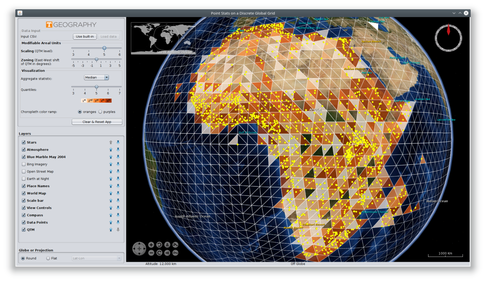

# DGGSPointViewer

A Java application that illustrates the [Modifiable Areal Unit Problem (MAUP)](https://en.wikipedia.org/wiki/Modifiable_areal_unit_problem), a long-standing issue in spatial statistics and geographic analysis. This app uses NASA's WorldWind virtual globe to visualize point datasets aggregated to various resolutions on a [discrete global grid system (DGGS)](https://en.wikipedia.org/wiki/Discrete_Global_Grid), namely Geoffrey Dutton's quarternary triangular mesh (QTM). The DGGS level can be chosen, thus changing bin size, and it can be slid east to west, changing bin location; these two behaviors illustrate the scaling and zoning aspects of the MAUP, respectively, in relative isolation from each other.

This software accompanies the following forthcoming academic paper:

Raposo, P., Robinson, A., & Brown, R. (2019). A Virtual Globe Using a Discrete Global Grid System to Illustrate the Modifiable Areal Unit Problem. *Cartographica*, 54(1).
